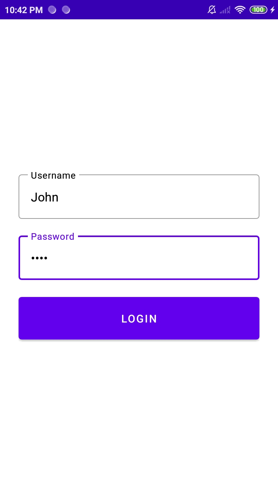

# Shopping App
This is a simple shopping app in Kotlin.

| Login Screen | Product List Screen | Product Detail Screen |
| ------------- | ------------- | ------------- |
|  |  |  |

## Features
- User Login
- User Logout
- Product List
- Product Detail

## API Documentation
This app uses Fake Store API for REST API ([Documentation](https://fakestoreapi.com/docs)).

## Tech stack & libraries
- Architecture
    - MVVM (Model-View-ViewModel)
    - Repository
    - Use Case
- [Kotlin](https://kotlinlang.org/) based,
    - [Coroutines](https://github.com/Kotlin/kotlinx.coroutines) & [Flow](https://kotlin.github.io/kotlinx.coroutines/kotlinx-coroutines-core/kotlinx.coroutines.flow/) for asynchronous
    - [State Flow & Shared Flow](https://kotlinlang.org/) for observable data holder
- Jetpack libraries
    - [ViewModel](https://developer.android.com/topic/libraries/architecture/viewmodel) for manage UI-related data
    - [Room Persistence](https://developer.android.com/topic/libraries/architecture/room) for database
    - [Navigation](https://developer.android.com/guide/navigation) for handling navigation
    - [Saved State](https://developer.android.com/topic/libraries/architecture/viewmodel-savedstate) for handling restore data
-   [Retrofit2 & OkHttp3](https://github.com/square/retrofit) for HTTP client
-   [Gson](https://github.com/google/gson) for JSON converter
-   [Glide](https://github.com/bumptech/glide) for load image
- Testing
   -  [JUnit4](https://junit.org/junit4/) for unit testing framework
    - [Truth](https://truth.dev/) for test assertions
    - [MockK](https://mockk.io/) for mocking framework
    - [Turbine](https://github.com/cashapp/turbine) for testing Flow
    - [Fragment Testing](https://developer.android.com/guide/fragments/test) for testing Fragment
    - [Robolectric](http://robolectric.org/) for UI test runner
    - [Espresso](https://developer.android.com/training/testing/espresso) for UI test assertions